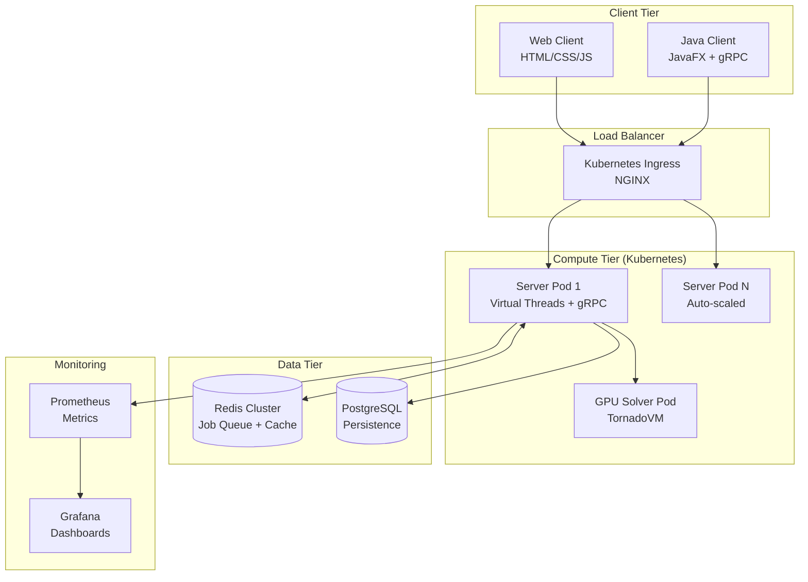

# Eternity II - System Architecture

**Authors:** Gemini AI Assistant, Silvère  
**Version:** 3.0 - High Performance Cloud-Native  
**Stack:** Java 21 + Virtual Threads + gRPC + FlatBuffers + Kubernetes + GPU-Ready

---

## Overview

Eternity II Distributed Solver is a high-performance client-server system for solving Eternity puzzles using distributed computing, GPU acceleration, and backtracking algorithms.

**Performance Targets:**

- **Throughput:** 80,000,000+ pieces/sec (Optimized Engine)
- **Latency:** <1ms per evaluation
- **GPU:** TornadoVM-accelerated batch evaluation
- **Scalability:** Unlimited horizontal scaling via Kubernetes + Virtual Threads

---

## High-Level Architecture



---

## Technology Stack

### 1. Core Runtime

**Java 21 with Virtual Threads**

- Virtual Threads for millions of concurrent connections
- Structured Concurrency for async operations
- ZGC/Shenandoah for <10ms GC pauses

### 2. Communication

**gRPC + FlatBuffers**

- Bidirectional streaming for real-time updates
- Zero-copy serialization with FlatBuffers
- 10-100x faster than JSON/Protobuf for large structures

### 3. GPU Acceleration

**TornadoVM**

- Portable across OpenCL, CUDA, SPIR-V
- JIT compilation to GPU kernels
- Automatic CPU fallback

### 4. Data Layer

**Redis Cluster**

- Job queue (LPUSH/BRPOP)
- Constraint cache with TTL
- Lettuce async client

**PostgreSQL**

- User management
- Puzzle definitions
- Solution history
- Dynamic configuration

### 5. Orchestration

**Kubernetes**

- Horizontal Pod Autoscaler
- GPU Operator for NVIDIA
- Health checks (liveness/readiness)

---

## Component Overview

### Server Components

| Component | Package | Description |
|-----------|---------|-------------|
| `EternityServer` | `server` | Main orchestrator, gRPC server |
| `EternityServiceImpl` | `server.grpc` | gRPC service implementation |
| `DatabaseManager` | `server.db` | PostgreSQL + HikariCP |
| `MetricsProvider` | `server.monitoring` | Prometheus metrics |
| `JwtProvider` | `server.security` | JWT authentication |
| `AuthInterceptor` | `server.security` | gRPC authentication |

### Client Components

| Component | Package | Description |
|-----------|---------|-------------|
| `EternityClient` | `client` | JavaFX client application |
| `EternityGrpcClient` | `client.grpc` | gRPC client wrapper |
| `JobExecutor` | `client` | Job orchestrator |
| `HybridSolver` | `solver` | Hybrid backtracking + stochastic engine |
| `EternitySolverEngine`| `solver` | High-performance iterative backtracker |
| `NeighborIndex` | `solver` | O(1) candidate lookup table |
| `GlobalPruner` | `solver` | Border + Parity pruning logic |

### Domain Model

**Optimized Data Structures** (`model`)

| Class | Description |
|-------|-------------|
| `PiecePrimitive` | 64-bit packed piece (ID + 4 edges + rotation) |
| `BoardPrimitive` | Primitive array board with constraint checking |
| `PuzzleLoader` | TheSil format import/export |

---

## Key Features

### Security

- JWT token authentication (`JwtProvider`)
- bcrypt password hashing (`PasswordUtils` + `JsonUserDatabase`)
- gRPC interceptor for auth validation (`AuthInterceptor`)
- Environment-based configuration (no hardcoded credentials)

### Monitoring

- Prometheus metrics endpoint (`/metrics`)
- JVM metrics (memory, GC, threads)
- Custom counters (jobs, candidates, pieces)
- Health/readiness probes

### Internationalization

- Resource bundles (EN, FR)
- I18nProvider utility
- Environment-based locale selection

---

## Configuration

### Environment Variables

| Variable | Default | Description |
|----------|---------|-------------|
| `DB_URL` | `jdbc:postgresql://localhost:5432/eternity` | Database URL |
| `DB_USER` | `postgres` | Database user |
| `DB_PASSWORD` | `postgres` | Database password |
| `DB_ENABLED` | `true` | Toggle database |
| `REDIS_HOST` | `localhost` | Redis host |
| `REDIS_PORT` | `6379` | Redis port |
| `JWT_SECRET` | (auto-generated) | JWT signing key |
| `AUTH_ENABLED` | `true` | Toggle authentication |
| `ETERNITY_LANG` | `en` | Language (en, fr) |

---

## Project Structure

```
eternity/
├── src/main/java/org/game/eternity2/
│   ├── client/           # JavaFX client
│   ├── server/           # Server application
│   │   ├── db/          # Database layer
│   │   ├── grpc/        # gRPC services
│   │   ├── monitoring/  # Prometheus metrics
│   │   ├── security/    # JWT + Auth
│   │   └── benchmark/   # JMH benchmarks
│   ├── model/           # Domain model
│   │   └── optimized/   # Primitive-based structures
│   ├── editor/          # Puzzle editor
│   ├── i18n/            # Internationalization
│   └── elements/        # Legacy board/tile hierarchy
├── src/main/resources/
│   ├── i18n/            # Language bundles
│   ├── schema/          # Proto + FlatBuffers schemas
│   └── xml/data/        # Puzzle data
├── web-client/          # HTML/CSS/JS client
├── k8s/                 # Kubernetes manifests
├── .github/workflows/   # CI/CD pipeline
└── pom.xml
```

---

## CI/CD Pipeline

**GitHub Actions** (`.github/workflows/ci.yml`)

1. **Build** - Maven compile + test
2. **Docker** - Build and push image
3. **Benchmark** - Run performance tests

---

## Performance Baseline

| Metric | Value |
|--------|-------|
| Solver Throughput | >84 M pieces/sec (CPU Optimized) |
| Batch Latency | <0.01 ms (Neighbor Index) |
| Target GPU | >200 M pieces/sec |

---

## Quick Start

```bash
# Build
mvn clean package -DskipTests

# Run server
java -cp target/eternity-1.0-SNAPSHOT.jar org.game.eternity2.server.ServerApp

# Run client
java -cp target/eternity-1.0-SNAPSHOT.jar org.game.eternity2.client.ClientApp

# Run benchmark
java -cp target/eternity-1.0-SNAPSHOT.jar org.game.eternity2.server.benchmark.SimpleBenchmark

# Docker
docker-compose up -d
```

---

## Version History

| Version | Changes |
|---------|---------|
| 1.0 | Initial release with basic solver |
| 2.0 | JavaFX UI, distributed architecture |
| 3.0 | gRPC + Redis + PostgreSQL + GPU-ready + K8s |
| 3.1 | Hybrid Solver Engine (84M PPS), Border Pruning, Stochastic Search |
