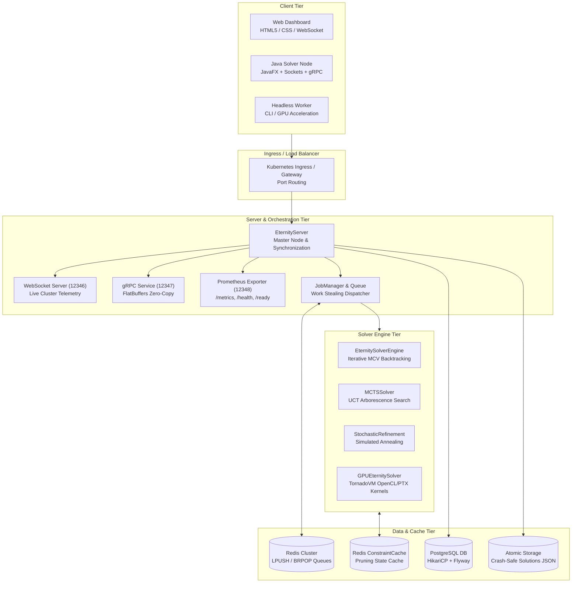

# Eternity II - System Architecture

**Authors:** Silvère Martin-Michiellot, Antigravity (Google DeepMind)  
**Version:** 4.0 - High Performance Cloud-Native & GPU-Accelerated  
**Stack:** Java 25 (`--enable-preview`) + Virtual Threads + gRPC + FlatBuffers + TornadoVM GPU + Kubernetes

---

## 1. Executive Summary

Eternity II is a high-performance distributed solver designed to tackle large-scale edge-matching combinatorics ($16 \times 16$ board with $256$ pieces). The system combines low-level bitwise primitive acceleration, multi-paradigm solving algorithms (MCV Backtracking, MCTS, Stochastic Simulated Annealing, GPU Offloading), zero-copy binary network serialization, and distributed job orchestration.

---

## 2. High-Level Architecture Diagram

---

## 3. Technology Stack & Component Details

### 3.1 Zero-Allocation Domain Model (`org.game.eternity2.model`)
- **`PiecePrimitive`:** 64-bit packed scalar (`long`) containing:
  - `ID`: 16 bits (0 to 65,535)
  - `Top Edge`: 8 bits (0 to 255)
  - `Right Edge`: 8 bits (0 to 255)
  - `Bottom Edge`: 8 bits (0 to 255)
  - `Left Edge`: 8 bits (0 to 255)
  - `Rotation`: 8 bits (0 to 3)
- **`BoardPrimitive`:** Flat 1D `long[]` board representation allowing instant boundary constraint checking and mismatch calculations without allocating intermediate objects.

### 3.2 Solving Strategies (`org.game.eternity2.solver`)
1. **Iterative MCV Backtracking (`EternitySolverEngine`):**
   - Row-scanning with Most Constrained Variable heuristic.
   - Bit-vector lookups with `NeighborIndex` and `GlobalPruner`.
   - Immutable hint tile enforcement via `boolean[] isFixed`.
2. **Monte Carlo Tree Search (`MCTSSolver`):**
   - Upper Confidence Bound for Trees: $UCT = \frac{W_i}{N_i} + c \sqrt{\frac{\ln N_p}{N_i}}$ with $c = \sqrt{2}$.
   - Stochastic rollout on remaining tile pools with terminal dead-end detection.
3. **GPU Hardware Offloading (`GPUEternitySolver` & `TornadoEternityDriver`):**
   - TornadoVM OpenCL/PTX kernels compiling candidate validation directly to parallel compute units.
4. **Stochastic Refinement (`StochasticRefinement`):**
   - Simulated annealing escaping local maxima via 1-tile rotations and 2-tile swaps.

### 3.3 Zero-Copy Network & Distributed Queues (`org.game.eternity2.io`, `server.grpc`)
- **gRPC + FlatBuffers:** High-throughput streaming of binary board states directly out of raw buffers without heap allocation.
- **WebSocket Gateway:** Real-time push notifications of score improvements, active client counts, and live board tessellations.
- **Redis Work Queue:** Asynchronous work distribution with Lettuce client.

### 3.4 Security & Hardening (`org.game.eternity2.server.security`)
- **Anti-RCE Socket Filter:** `ObjectInputFilter` whitelist on native TCP sockets.
- **BCrypt Password Hashing:** Salted hashing with `at.favre.lib:bcrypt`.
- **JWT Authentication:** 256-bit HS256 tokens with in-memory secure random key fallback.
- **Atomic File Persistence:** Crash-resilient file writes using temporary `.tmp` files and `StandardCopyOption.ATOMIC_MOVE`.

---

## 4. Port Allocations (Default Base Port: 12345)

| Port | Protocol | Purpose |
| :--- | :--- | :--- |
| `12345` | TCP (Custom Sockets) | Native cluster solving channel with `ObjectInputFilter` |
| `12346` | WebSocket (`ws://`) | Real-time web client telemetry and board rendering |
| `12347` | gRPC (`HTTP/2`) | High-performance RPC with FlatBuffers serialization |
| `12348` | HTTP | Prometheus metrics (`/metrics`), health (`/health`), readiness (`/ready`) |

---

© 2026 Silvère Martin-Michiellot & Antigravity
