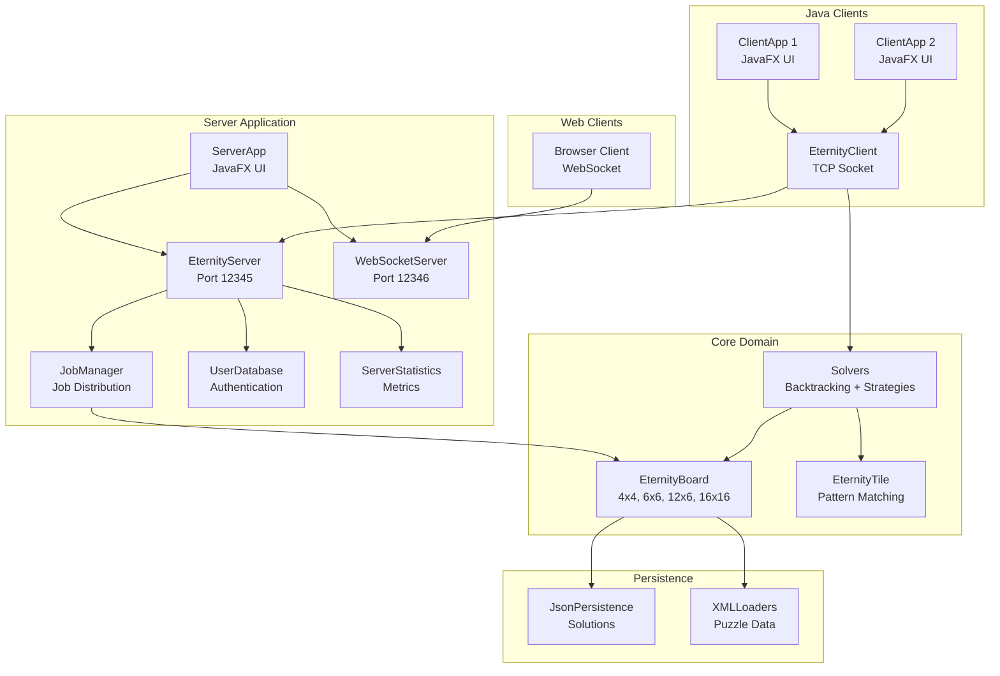

# Eternity II - System Architecture

## Overview

Eternity II Distributed Solver is a multithreaded client-server system for solving Eternity puzzles using distributed computing and backtracking algorithms.

## System Architecture



## Component Overview

### 1. Server Components

#### **ServerApp** (`org.game.eternity2.server.ServerApp`)
- JavaFX-based UI for server management
- Configuration management (board size, strategy selection)
- Real-time statistics display
- Splash screen with application branding

#### **EternityServer** (`org.game.eternity2.server.EternityServer`)
- Main server orchestration
- Multi-threaded client handling via `ClientHandler`
- TCP socket communication (port 12345)
- WebSocket server integration (port 12346)

#### **EternityWebSocketServer** (`org.game.eternity2.server.EternityWebSocketServer`)
- WebSocket-based communication for web clients
- JSON message protocol
- Handles LOGIN, JOB_REQUEST, RESULT_SUBMISSION

#### **JobManager** (`org.game.eternity2.server.JobManager`)
- Job creation and distribution
- Work strategy application (BorderFirst, Scanline)
- Result validation and aggregation

#### **UserDatabase** (`org.game.eternity2.server.UserDatabase`)
- User authentication and auto-registration
- Persistent storage in `users.dat`

#### **ServerStatistics** (`org.game.eternity2.server.ServerStatistics`)
- Real-time metrics tracking
- Client connection monitoring
- Job processing statistics

### 2. Client Components

#### **ClientApp** (`org.game.eternity2.client.ClientApp`)
- JavaFX-based UI for solver client
- Connection management
- Statistics display
- Configuration loading

#### **EternityClient** (`org.game.eternity2.client.EternityClient`)
- Server connection via TCP socket
- Job request/receive cycle
- Result submission
- Auto-reconnect logic

#### **JobExecutor** (`org.game.eternity2.client.JobExecutor`)
- Executes solving jobs using configured solver
- Timeout management
- Progress reporting

#### **Solvers**
- `BasicEternitySolver` - Simple backtracking
- `RarePatternSolver` - Pattern rarity prioritization
- `AdvancedEternitySolver` - Placeholder for advanced strategies

### 3. Domain Model

#### **Board Hierarchy**
```
EternityBoardInterface
├── AbstractEternityBoard
│   ├── EternityBoard4x4
│   ├── EternityBoard6x6
│   ├── EternityBoard12x6
│   └── EternityBoard16x16
```

**Key Responsibilities:**
- Tile placement validation
- Neighbor matching
- Border pattern enforcement
- Hint tile management
- Score calculation

#### **Tile Hierarchy**
```
EternityTileInterface
├── AbstractEternityTile
│   ├── EternityTile4x4
│   ├── EternityTile6x6
│   ├── EternityTile12x6
│   └── EternityTile16x16
```

**Key Features:**
- 4-sided pattern matching
- Rotation support (0°, 90°, 180°, 270°)
- Border pattern identification
- Image representation

#### **Pattern System**
```
AbstractEternityBasicPattern
├── EternityBasicPattern4x4 (7 patterns)
├── EternityBasicPattern6x6 (13 patterns)
├── EternityBasicPattern12x6 (17 patterns)
└── EternityBasicPattern16x16 (22 patterns)
```

### 4. Work Distribution Strategies

#### **BorderFirstStrategy** (`org.game.eternity2.server.BorderFirstStrategy`)
- Prioritizes border tiles
- Reduces search space early
- Better for constraint propagation

#### **WorkStrategy** (Interface)
- Pluggable strategy system
- Custom job decomposition
- Future strategies: corner-first, diagonal, spiral

### 5. Persistence Layer

#### **JsonSolutionPersistence** (`org.game.eternity2.io.JsonSolutionPersistence`)
- Saves/loads board states as JSON
- Tracks tile positions and rotations
- Timestamped solution files in `solutions/`

#### **XML Loaders**
- `EternityBoardXMLFileReader` - Board configurations
- `EternityTilesXMLFileReader` - Tile definitions
- `EternityHintsXMLFileReader` - Hint placements

### 6. Communication Protocol

#### **TCP/IP (Java Clients)**
- Serialized `EternityPacket` objects
- Commands: LOGIN, JOB_REQUEST, JOB_RESPONSE, RESULT_SUBMISSION
- Persistent connections with heartbeat

#### **WebSocket (Web Clients)**
- JSON-based messaging
- Same command structure as TCP
- Browser-compatible

## Data Flow

### Job Distribution Flow
```
1. Client → Server: JOB_REQUEST
2. Server (JobManager): Create job based on strategy
3. Server → Client: JOB_RESPONSE (board state + constraints)
4. Client (JobExecutor): Execute solver
5. Client → Server: RESULT_SUBMISSION (solution or timeout)
6. Server (JobManager): Validate and aggregate results
```

### Authentication Flow
```
1. Client → Server: LOGIN (username/password)
2. Server (UserDatabase): Verify or auto-register
3. Server → Client: LOGIN_SUCCESS or LOGIN_FAILURE
```

## Configuration

### Server Configuration (`server-config.properties`)
- `server.port` - TCP port (default: 12345)
- `server.maxClients` - Maximum concurrent clients
- `job.timeout` - Job execution timeout

### Client Configuration (`client-config.properties`)
- `client.serverHost` - Server address
- `client.serverPort` - Server port
- `solver.timeoutSeconds` - Solver timeout

## Logging

### Log4j2 Configuration (`log4j2.xml`)
- **Server logs:** `logs/server.log`
- **Client logs:** `logs/client.log`
- Rolling file appender with timestamps
- Console output for development

## Build System

### Maven (`pom.xml`)
- **Dependencies:**
  - JavaFX 19 (UI)
  - Log4j2 (Logging)
  - Gson (JSON)
  - Java-WebSocket (WebSocket support)
  - JetBrains Annotations (Code quality)

- **Plugins:**
  - Maven Compiler (Java 21)
  - Maven Exec (Run applications)

## Project Structure

```
eternity/
├── src/main/java/org/game/eternity2/
│   ├── client/           # Client application
│   ├── server/           # Server application
│   ├── elements/         # Domain model (boards, tiles, patterns)
│   │   ├── size4x4/
│   │   ├── size6x6/
│   │   ├── size12x6/
│   │   └── size16x16/
│   ├── io/              # Persistence and loaders
│   └── config/          # Configuration management
├── src/main/resources/
│   ├── xml/data/        # Puzzle data files
│   ├── images/          # Patterns, tiles, splash screen
│   ├── web/             # Web client (HTML/JS)
│   └── *.properties     # Configuration files
├── src/test/java/       # Unit tests
├── papers/              # Research papers (13 PDFs)
├── solutions/           # Saved solutions
├── logs/                # Application logs
└── pom.xml              # Maven configuration
```

## Documentation Location

### Code Documentation
- **Package Documentation:** `package-info.java` in each package
  - `org.game.eternity2`
  - `org.game.eternity2.client`
  - `org.game.eternity2.server`
  - `org.game.eternity2.elements`
  - `org.game.eternity2.elements.size4x4`
  - `org.game.eternity2.elements.size6x6`
  - `org.game.eternity2.elements.size12x6`
  - `org.game.eternity2.elements.size16x16`
  - `org.game.eternity2.io`

### User Documentation
- **README.md** - Quick start and overview
- **readme.txt** - Original project description
- **ARCHITECTURE.md** - This file (system architecture)

### Research Materials
- **papers/** directory contains 13 research papers on Eternity II solving techniques

### Generated Documentation
- **JavaDoc:** Generate with `mvn javadoc:javadoc`
- **Output:** `target/site/apidocs/`

## Key Design Patterns

1. **Strategy Pattern** - Pluggable work distribution strategies
2. **Factory Pattern** - Board and tile creation based on size
3. **Observer Pattern** - UI updates from server/client events
4. **Command Pattern** - Network packet handling
5. **Singleton Pattern** - Configuration management

## Threading Model

### Server
- **Main Thread:** JavaFX UI
- **Accept Thread:** Client connection acceptance
- **Client Handler Threads:** One per connected client
- **WebSocket Thread:** WebSocket server

### Client
- **Main Thread:** JavaFX UI
- **Connection Thread:** Server communication
- **Executor Thread:** Job solving

## Future Enhancements

1. **Advanced Solvers:** Constraint propagation, pattern databases
2. **Distributed Coordination:** Multi-server federation
3. **Machine Learning:** Pattern recognition for heuristics
4. **Web UI Improvements:** Real-time board visualization
5. **Persistence:** Database integration for large-scale deployments

## Version History

- **v1.0** - Initial release with basic solver
- **v2.0** - JavaFX UI, distributed architecture
- **v2.1** - WebSocket support, rotation tracking, multiple solver strategies

## References

See `papers/` directory for research references on Eternity II solving techniques.
