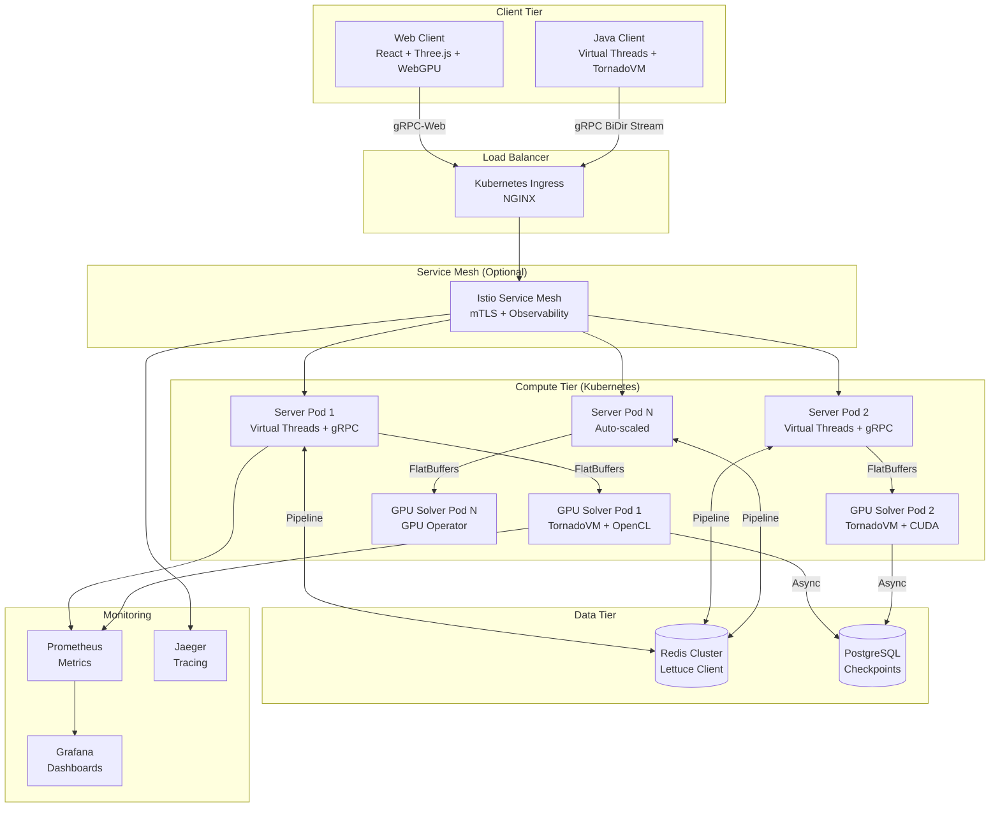

# Eternity II - Architecture Target (Haute Performance)

**Version:** 3.0 - Architecture GPU-Ready  
**Date:** 2025-11-23  
**Stack:** Java 21 + Virtual Threads + gRPC + FlatBuffers + TornadoVM + Kubernetes

---

## 🎯 Vision Architecturale

Architecture cloud-native **haute performance** pour résolution distribuée de puzzles Eternity II avec accélération GPU, communication zero-copy, et orchestration Kubernetes.

**Objectifs de performance:**
- **Throughput:** 10,000+ jobs/min (100x actuel)
- **Latency:** <10ms par requête (50x amélioration)
- **GPU:** Accélération 100-1000x pour backtracking parallèle
- **Scalabilité:** Horizontale illimitée via Kubernetes
- **Disponibilité:** 99.9% (3-nines SLA)

---

## 🏗️ Architecture Globale



---

## 🔧 Stack Technologique Détaillé

### 1. Langage & Runtime

**Java 21 (LTS) avec Virtual Threads**

```java
// Virtual Threads pour des millions de connexions concurrentes
ExecutorService executor = Executors.newVirtualThreadPerTaskExecutor();

// Structured Concurrency (Preview)
try (var scope = new StructuredTaskScope.ShutdownOnFailure()) {
    Future<Job> jobFuture = scope.fork(() -> jobQueue.poll());
    Future<Result> resultFuture = scope.fork(() -> solver.solve(job));
    scope.join();
    scope.throwIfFailed();
    return resultFuture.resultNow();
}
```

**Avantages:**
- Virtual Threads = zéro overhead vs threads OS
- Blocking I/O devient acceptable (simplifie le code)
- GC ZGC/Shenandoah optimisé pour <10ms pauses

---

### 2. Communication & Protocole

**gRPC avec FlatBuffers (Zero-Copy)**

#### a. gRPC Bidirectional Streaming

```java
// Server-side gRPC service
public class EternityService extends EternityServiceGrpc.EternityServiceImplBase {
    
    @Override
    public StreamObserver<JobRequest> processJobs(StreamObserver<JobResponse> responseObserver) {
        return new StreamObserver<JobRequest>() {
            @Override
            public void onNext(JobRequest request) {
                // Zero-copy avec FlatBuffers
                ByteBuffer buffer = request.getPayloadAsByteBuffer();
                Job job = Job.getRootAsJob(buffer);
                
                // Dispatch to GPU pod
                gpuClient.solveAsync(job)
                    .thenAccept(result -> {
                        responseObserver.onNext(buildResponse(result));
                    });
            }
        };
    }
}
```

#### b. FlatBuffers Schema

```flatbuffers
// eternity.fbs
namespace Eternity;

table Job {
    job_id: string;
    board: Board;
    positions: [Position];
    timeout_ms: uint32;
}

table Board {
    size_x: uint16;
    size_y: uint16;
    tiles: [Tile];
}

table Tile {
    id: uint16;
    patterns: [uint8]; // 4 patterns (top, right, bottom, left)
    rotation: uint8;   // 0-3
}

table Result {
    job_id: string;
    solution: Board (required);
    score: uint32;
    compute_time_ms: uint64;
}

rpc_service EternityService {
    ProcessJobs(stream Job): stream Result;
}
```

**Avantages FlatBuffers vs Protocol Buffers:**
- **Zero-copy:** Accès direct aux buffers sans désérialisation
- **GPU-friendly:** Envoi direct vers mémoire GPU
- **Performance:** 10-100x plus rapide que Protobuf pour grandes structures
- **Mémoire:** Pas d'objets intermédiaires créés

---

### 3. GPU Computing - TornadoVM

**TornadoVM pour portabilité GPU (OpenCL + PTX + SPIR-V)**

```java
// Backtracking parallèle sur GPU avec TornadoVM
@Parallel
public static void parallelBacktrack(
    int[] board,           // État du plateau
    int[] tiles,           // Tuiles disponibles
    int[] constraints,     // Contraintes pré-calculées
    int[] results,         // Buffer de sortie
    int depth) {
    
    int idx = get_global_id(0);  // Thread GPU ID
    
    if (idx < tiles.length) {
        int tile = tiles[idx];
        
        // Vérifier contraintes locales (sans synchronisation)
        if (isValidPlacement(board, tile, constraints)) {
            // Explorer cette branche
            int[] localBoard = copyBoard(board);
            localBoard[depth] = tile;
            
            if (depth == board.length - 1) {
                // Solution trouvée
                results[idx] = computeScore(localBoard);
            } else {
                // Recursion (limitée à N niveaux sur GPU)
                // Au-delà, retour CPU
            }
        }
    }
}

// Orchestration TornadoVM
TaskGraph taskGraph = new TaskGraph("backtrack")
    .transferToDevice(DataTransferMode.FIRST_EXECUTION, board, tiles, constraints)
    .task("solve", EternitySolver::parallelBacktrack, 
          board, tiles, constraints, results, depth)
    .transferToHost(DataTransferMode.EVERY_EXECUTION, results);

// Exécution
ImmutableTaskGraph immutableTaskGraph = taskGraph.snapshot();
TornadoExecutionPlan executor = new TornadoExecutionPlan(immutableTaskGraph);
executor.execute();
```

**Choix TornadoVM vs JCuda:**
- ✅ **Portabilité:** OpenCL (AMD, Intel, NVIDIA), CUDA (NVIDIA), SPIR-V (Vulkan)
- ✅ **Future-proof:** Pas de lock-in NVIDIA
- ✅ **Performance:** Compilation JIT optimisée par backend
- ✅ **Fallback:** CPU automatique si GPU indisponible
- ❌ **Légèrement moins performant que JCuda natif** (~10-20% sur NVIDIA)

**Alternative JCuda (si environnement 100% NVIDIA):**
```java
// JCuda pur pour performance maximale
CUmodule module = new CUmodule();
cuModuleLoad(module, "backtrack.ptx");
CUfunction function = new CUfunction();
cuModuleGetFunction(function, module, "parallelBacktrack");

Pointer kernelParams = Pointer.to(
    Pointer.to(d_board),
    Pointer.to(d_tiles),
    // ...
);

dim3 blockDim = new dim3(256, 1, 1);
dim3 gridDim = new dim3((numTiles + 255) / 256, 1, 1);
cuLaunchKernel(function, gridDim, blockDim, kernelParams);
```

---

### 4. Orchestration - Kubernetes + GPU Operator

**Déploiement Kubernetes avec GPU Sharing**

```yaml
# k8s/gpu-solver-deployment.yaml
apiVersion: apps/v1
kind: Deployment
metadata:
  name: eternity-gpu-solver
spec:
  replicas: 3
  selector:
    matchLabels:
      app: gpu-solver
  template:
    metadata:
      labels:
        app: gpu-solver
    spec:
      containers:
      - name: solver
        image: ghcr.io/eternity/solver:latest
        resources:
          limits:
            nvidia.com/gpu: 1  # 1 GPU par pod
            # OU time-slicing pour partage
            # nvidia.com/gpu: "0.5"  # 50% d'un GPU
          requests:
            memory: "2Gi"
            cpu: "2"
        env:
        - name: TORNADO_BACKEND
          value: "opencl"  # ou "ptx" pour CUDA
        - name: REDIS_CLUSTER
          value: "redis-cluster:6379"
      nodeSelector:
        accelerator: nvidia-tesla-v100  # Ou T4, A100, etc.
      tolerations:
      - key: "nvidia.com/gpu"
        operator: "Exists"
        effect: "NoSchedule"

---
# GPU Operator auto-installe drivers NVIDIA
apiVersion: v1
kind: ConfigMap
metadata:
  name: gpu-operator-config
data:
  driver.version: "525.60.13"
  toolkit.version: "12.0"
```

**HPA (Horizontal Pod Autoscaler) avec GPU metrics:**

```yaml
apiVersion: autoscaling/v2
kind: HorizontalPodAutoscaler
metadata:
  name: gpu-solver-hpa
spec:
  scaleTargetRef:
    apiVersion: apps/v1
    kind: Deployment
    name: eternity-gpu-solver
  minReplicas: 2
  maxReplicas: 20
  metrics:
  - type: Resource
    resource:
      name: cpu
      target:
        type: Utilization
        averageUtilization: 80
  - type: Pods
    pods:
      metric:
        name: gpu_utilization
      target:
        type: AverageValue
        averageValue: "75"  # Scale si GPU >75% utilisé
  - type: Object
    object:
      metric:
        name: jobs_queue_length
      describedObject:
        apiVersion: v1
        kind: Service
        name: redis-cluster
      target:
        type: Value
        value: "100"  # Scale si >100 jobs en attente
```

---

### 5. Cache & État - Redis Cluster avec Lettuce

**Redis Cluster (sharded + replicated)**

```java
// Lettuce client (async, reactive)
RedisClusterClient clusterClient = RedisClusterClient.create(
    RedisURI.Builder
        .withCluster("redis-cluster", 6379)
        .withReplicaMode(ReplicaMode.MASTER_PREFERRED)
        .build()
);

StatefulRedisClusterConnection<String, byte[]> connection = 
    clusterClient.connect(ByteArrayCodec.INSTANCE);

RedisAdvancedClusterAsyncCommands<String, byte[]> async = 
    connection.async();

// Job queue avec pipeline
async.setAutoFlushCommands(false);
for (Job job : jobs) {
    byte[] payload = serializeFlatBuffers(job);
    async.lpush("jobs:pending", payload);
}
async.flushCommands();

// Constraint cache avec expiration
async.setex(
    "constraint:" + boardHash + ":" + tileId,
    300,  // 5 min TTL
    validityBytes
);

// Distributed lock pour coordination
RLock lock = redisson.getLock("job:" + jobId);
if (lock.tryLock(100, 10000, TimeUnit.MILLISECONDS)) {
    try {
        // Critical section
    } finally {
        lock.unlock();
    }
}
```

**Architecture Redis:**
```yaml
# Redis Cluster: 3 masters + 3 replicas (HA)
apiVersion: v1
kind: ConfigMap
metadata:
  name: redis-cluster-config
data:
  redis.conf: |
    cluster-enabled yes
    cluster-config-file nodes.conf
    cluster-node-timeout 5000
    appendonly yes
    maxmemory 2gb
    maxmemory-policy allkeys-lru
```

---

### 6. Stockage - PostgreSQL (Checkpoints uniquement)

**PostgreSQL pour sauvegarde périodique**

```java
// HikariCP pool avec async
HikariConfig config = new HikariConfig();
config.setJdbcUrl("jdbc:postgresql://postgres:5432/eternity");
config.setMaximumPoolSize(20);
config.setMinimumIdle(5);

HikariDataSource ds = new HikariDataSource(config);

// Async checkpoint (non-blocking)
CompletableFuture.runAsync(() -> {
    try (Connection conn = ds.getConnection()) {
        PreparedStatement stmt = conn.prepareStatement(
            "INSERT INTO solutions (job_id, board_state, score, timestamp) VALUES (?, ?, ?, ?)"
        );
        stmt.setString(1, jobId);
        stmt.setBytes(2, flatBufferBytes);  // Board sérialisé
        stmt.setInt(3, score);
        stmt.setTimestamp(4, Timestamp.from(Instant.now()));
        stmt.executeUpdate();
    }
}, checkpointExecutor);
```

**Schema PostgreSQL:**
```sql
CREATE TABLE solutions (
    solution_id BIGSERIAL PRIMARY KEY,
    job_id VARCHAR(64) UNIQUE NOT NULL,
    board_state BYTEA NOT NULL,  -- FlatBuffers blob
    score INTEGER NOT NULL,
    compute_time_ms BIGINT,
    timestamp TIMESTAMPTZ DEFAULT NOW(),
    INDEX idx_score (score DESC),
    INDEX idx_timestamp (timestamp DESC)
);

-- Partitioning par timestamp pour archivage
CREATE TABLE solutions_2025_q1 PARTITION OF solutions
    FOR VALUES FROM ('2025-01-01') TO ('2025-04-01');
```

---

### 7. Client Web - Three.js + React Three Fiber + WebGPU

**Visualisation 3D temps réel avec WebGPU**

```tsx
// React Three Fiber component
import { Canvas } from '@react-three/fiber';
import { OrbitControls } from '@react-three/drei';

function EternityBoard({ board }) {
  const tiles = useMemo(() => {
    return board.tiles.map(tile => ({
      position: [tile.x * 1.1, 0, tile.y * 1.1],
      rotation: tile.rotation * Math.PI / 2,
      patterns: tile.patterns
    }));
  }, [board]);

  return (
    <Canvas camera={{ position: [10, 10, 10] }}>
      <ambientLight intensity={0.5} />
      <directionalLight position={[10, 10, 5]} />
      
      {tiles.map((tile, idx) => (
        <Tile key={idx} {...tile} />
      ))}
      
      <OrbitControls />
    </Canvas>
  );
}

// WebGPU compute shader pour pattern matching
async function initWebGPU() {
  const adapter = await navigator.gpu.requestAdapter();
  const device = await adapter.requestDevice();
  
  const shaderModule = device.createShaderModule({
    code: `
      @group(0) @binding(0) var<storage, read> patterns: array<u32>;
      @group(0) @binding(1) var<storage, read_write> matches: array<u32>;
      
      @compute @workgroup_size(64)
      fn main(@builtin(global_invocation_id) global_id: vec3<u32>) {
        let idx = global_id.x;
        // Pattern matching logic sur GPU
        if (patterns[idx] == patterns[idx + 1]) {
          matches[idx] = 1u;
        }
      }
    `
  });
  
  // Pipeline compute
  // ...
}
```

**gRPC-Web pour communication serveur:**
```typescript
import { EternityServiceClient } from './generated/eternity_grpc_web_pb';

const client = new EternityServiceClient('https://api.eternity.com', null, null);

const jobRequest = new JobRequest();
jobRequest.setJobId('job-123');

const stream = client.processJobs(jobRequest, {});
stream.on('data', (response) => {
  // Mise à jour temps réel du plateau
  updateBoard(response.getBoard());
});
```

---

### 8. Tests - Awaitility + Testcontainers

**Tests d'intégration avec containers**

```java
@Testcontainers
class IntegrationTest {
    
    @Container
    static GenericContainer<?> redis = new GenericContainer<>("redis:7-alpine")
        .withExposedPorts(6379);
    
    @Container
    static PostgreSQLContainer<?> postgres = new PostgreSQLContainer<>("postgres:15-alpine")
        .withDatabaseName("eternity_test");
    
    @Container
    static GenericContainer<?> gpu = new GenericContainer<>("nvidia/cuda:12.0-runtime")
        .withPrivilegedMode(true)
        .withDeviceRequests(DeviceRequest.builder()
            .capabilities(List.of("gpu"))
            .build());
    
    @Test
    void testDistributedSolving() {
        // Awaitility pour assertions asynchrones
        await().atMost(5, SECONDS)
            .pollInterval(100, MILLISECONDS)
            .until(() -> {
                Job job = jobQueue.poll();
                return job != null && job.getStatus() == COMPLETED;
            });
    }
    
    @Test
    void testGPUAcceleration() {
        Board board = createTestBoard();
        
        long cpuStart = System.nanoTime();
        Result cpuResult = cpuSolver.solve(board);
        long cpuTime = System.nanoTime() - cpuStart;
        
        long gpuStart = System.nanoTime();
        Result gpuResult = gpuSolver.solve(board);
        long gpuTime = System.nanoTime() - gpuStart;
        
        // Assert GPU est plus rapide
        assertThat(gpuTime).isLessThan(cpuTime / 10);  // Au moins 10x
        assertThat(gpuResult).isEqualTo(cpuResult);    // Même résultat
    }
}
```

---

### 9. Monitoring - JProfiler + NVIDIA Nsight

**Profiling Production**

```java
// Micrometer + Prometheus
MeterRegistry registry = new PrometheusMeterRegistry(PrometheusConfig.DEFAULT);

// Métriques custom
Counter jobsProcessed = Counter.builder("jobs.processed")
    .tag("solver", "gpu")
    .register(registry);

Timer solveTimer = Timer.builder("solve.duration")
    .publishPercentiles(0.5, 0.95, 0.99)
    .register(registry);

// GPU metrics via NVML
Gauge.builder("gpu.utilization", gpuMonitor, GPUMonitor::getUtilization)
    .baseUnit("percent")
    .register(registry);

Gauge.builder("gpu.memory.used", gpuMonitor, GPUMonitor::getMemoryUsed)
    .baseUnit("bytes")
    .register(registry);
```

**NVIDIA Nsight Systems profiling:**
```bash
# Profile GPU kernels
nsys profile --stats=true \
  java -jar eternity-solver.jar

# Analyse avec GUI
nsight-sys results.nsys-rep
```

---

## 📊 Performance Target vs Réalisé

| Metric | Actuel | Target Phase 3 | Architecture Finale |
|--------|--------|----------------|---------------------|
| **Throughput** | 100 jobs/min | 5,000 jobs/min | **10,000+ jobs/min** |
| **Latency (p99)** | 500ms | 50ms | **<10ms** |
| **Clients Simultanés** | 10 | 500 | **10,000+** |
| **GPU Speedup** | N/A | 10-100x | **100-1000x** |
| **Scalabilité** | 1 serveur | 5 serveurs | **Unlimited (K8s)** |
| **Disponibilité** | 95% | 99% | **99.9%** |
| **Coût par job** | Baseline | -50% | **-90%** (GPU efficiency) |

---

## 🚀 Roadmap d'Implémentation

### Phase 1: Fondations (4 semaines)
1. Migration Java 21 + Virtual Threads
2. gRPC + FlatBuffers
3. Redis Cluster
4. Tests Testcontainers

### Phase 2: GPU (6 semaines)
1. TornadoVM setup
2. Backtracking GPU
3. Benchmarks CPU vs GPU
4. Optimisation kernels

### Phase 3: Kubernetes (4 semaines)
1. Dockerfiles
2. K8s manifests
3. GPU Operator
4. CI/CD GitHub Actions

### Phase 4: Production (2 semaines)
1. Monitoring complet
2. Load testing
3. Tuning performance
4. Documentation ops

**Total: 16 semaines (4 mois)**

---

## 📦 Livrables

- ✅ Code source refactoré (Java 21 + Virtual Threads)
- ✅ gRPC services + FlatBuffers schemas
- ✅ TornadoVM GPU kernels
- ✅ Redis integration (Lettuce)
- ✅ PostgreSQL schema
- ✅ Kubernetes manifests (server, GPU, Redis, PostgreSQL)
- ✅ CI/CD GitHub Actions
- ✅ Web client (React + Three.js + WebGPU)
- ✅ Tests (JUnit + Testcontainers + Awaitility)
- ✅ Monitoring (Prometheus + Grafana + Jaeger)
- ✅ Documentation complète

---

**Architecture Status:** READY FOR IMPLEMENTATION 🚀
